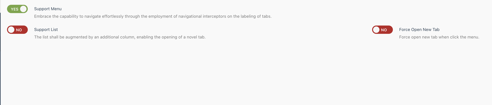

# Quickly and easily create fully-functioning Multiple Page in One Page for Winter CMS.

# install

```
composer require wpjscc/wn-mpage-plugin -vvv
```


# Setting



* Support Menu
    * Main Mav Menu Is Supported

* Support List
    * Add List Column
  
* Force Open New Tab
    * Force Open New Tab Regardless of whether it has been opened before or not

# Hand

```
<a class="btn btn-primary" onclick="$.wn.mpage.indexController.openNewTab({url:'xxxx'})">
    Open New Tab
</a>
```


# License

MIT